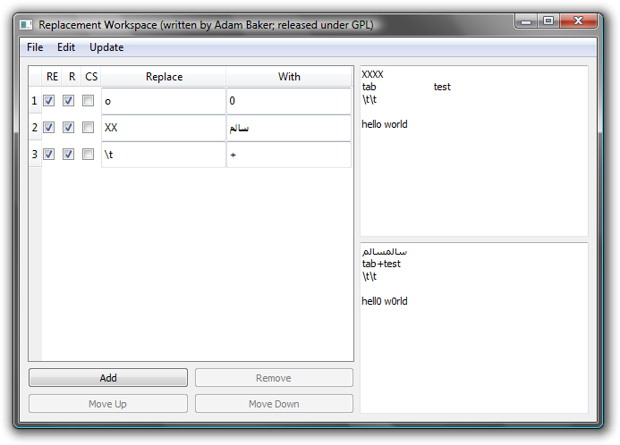

Replacement Workplace
------------

Replacement Workplace is a tool for making series of replacements in a text (I call these replacement “schemas”). Important features are:

*   User-interface that's visually intuitive and makes debugging your schema easy.
*   Ability to save and load schemas in XML format, for later re-use.



Instructions
------------

*   Load a text file using File|Load a text file. It appears in the upper right box. You can also type into this box.
*   The result of the replacements appears in the lower right box.
*   Click the “Add” button to add a replacement step.
    *   The boxes in the “Replace” and “With” columns mean what you'd expect them to.
    *   If the checkbox in the “RE” column is checked, the replacement expression is treated as a Perl-like regular expression. For instance ‘\\t’ is treated as the tab character, and you can do stuff with wildcards. (See [this page](http://doc.trolltech.com/4.6/qregexp.html#details) for more detail.)
    *   If the checkbox in the “R” column is checked, the replacement is applied recursively, which is to say, it applies the replacement until it can't apply anymore.
        *   Note that Replacement Workspace is not as smart as you should be. If you do a recursive replacement of X with XX, be prepared either to terminate the application early, or to wait for your computer to run out of memory.
    *   If the checkbox in the “CS” column is checked, the replacement is case sensitive.
*   You can select a replacement step by clicking on the row number. Note that somewhat counterintuitively, the currently selected row is not necessarily the one that has the cell that you're editing. (Which brings to mind another “feature”: you can't undo changes. Save frequently.)
*   Once you have a row selected, you can move it up or down in the list or remove it altogether. Guess which buttons do those actions?
*   Click “Update” to update your replacement text. The original text file is never modified. If you want to save the result, you need to copy it from the lower right box and paste it into a text application.
*   Load a replacement schema with File|Open Schema. You can modify it, and save it with File|Save Schema. If you're at all familiar with a markup language, or just a little intuitive, you'll be able to figure out the schema file format.
*   Process a lot of text files with the “Batch Transform” menu command. You'll be prompted for a prefix and a suffix for the outputted files. If your prefix is “prefix\_” and your suffix is “\_suffix” then transforming “my.file.text” will produce a file “prefix\_my.file\_suffix.text”. If the prefix and suffix are blank, then the original file will be modified.

Downloads
---------

Replacement Workspace is created with the [Qt application framework](https://www.qt.io/), released under the GNU Public License. That means, among other things, that you are free to download it and use it, but not to re-sell it.

Qt is a cross-platform framework, so there is the possibility for using this on Mac OS X, Linux, etc. Right now I only have Windows executables because I only have a Windows machine. Perhaps some do-gooder will build versions for other operating systems and send them to me.

I build in Windows with this, which assumes that Qt is installed and visible in your path:

```
qmake -config release
mingw32-make
```

Of course your system would have something different from “mingw32-make”—probably just “make”—if you are not building from Windows using MinGW.
